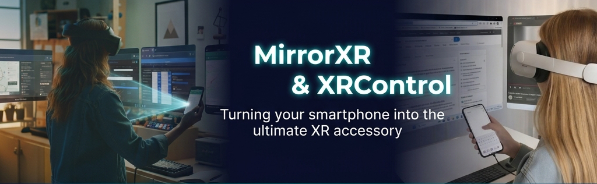
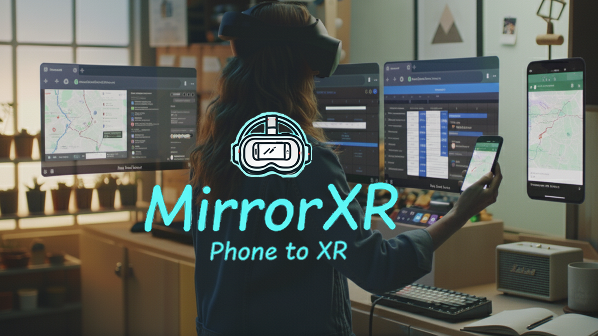

  

<h1 align="center">Shaping the XR Future: MirrorXR & XRControl 👋</h1>

  <em>"Turning your smartphone into the ultimate XR accessory."</em>

  
  

  
  

---

I'm a tech enthusiast specializing in **VR/AR/MR development**. Currently, I am focused on building **spatial interaction tools** that bridge the gap between **mobile devices** and **immersive headsets** like Meta Quest 3, Quest 3S, and other OpenXR-compatible hardware.

---

## 🚀 Featured Project: MirrorXR

  

**MirrorXR** is a high-performance **immersive streaming platform** designed for **ultra-low latency spatial experiences**. It empowers users to leverage mobile hardware as powerful XR peripherals, enabling seamless cross-device connectivity between smartphones, PCs, and MR headsets.

| Feature | Description |
|---|---|
| 🎯 **Ultra-Low Latency** | Real-time streaming optimized for spatial computing workloads |
| 🌐 **Cross-Platform** | Supports Meta Quest, Galaxy XR, and Android XR devices |
| 📱 **Phone-to-XR** | Turn your smartphone into a powerful XR streaming source |

  
  

---

## 🛠️ Ecosystem: XRControl

  

**XRControl** provides advanced **spatial interaction and device management solutions** for MR headsets, ensuring seamless cross-platform connectivity. It transforms your Android phone into a **wireless mouse, keyboard, and gamepad** using standard **Bluetooth HID** protocol.

| Feature | Description |
|---|---|
| 🎮 **Custom Game Layouts** | Drag-and-drop visual editor with joystick, D-Pad, ABXY, triggers |
| 🖱️ **Multi-Mode Input** | Touchpad, mouse, keyboard, gamepad & gyroscope control |
| 📐 **Gyroscope Mouse** | Tilt your phone to control the cursor — ergonomic & precise |
| 🔐 **Privacy First** | Zero data collection, Bluetooth peer-to-peer only |

  
  

---

## 📱 Core Technologies

Our products are built on cutting-edge spatial computing technologies:

- **Low-Latency Streaming** — Cross-device **WebRTC** & **Remote Rendering** pipelines
- **Spatial Anchors** — Precise control and interaction in **3D space**
- **Bluetooth HID** — Standard protocol for universal device compatibility
- **Platform Support** — **Meta Quest 2/3/3S**, Android, Windows (**OpenXR**)
- **Spatial Interaction** — Next-gen input systems for **Mixed Reality** workflows

---

## 💻 Tech Stack

---

## 📫 Contact

For **enterprise solutions**, **SDK inquiries**, or **partnership opportunities**, reach out through our official channels:

  
  
  

---

## ☕ Support

If you find our work valuable, consider supporting us:

---

  © 2025 MirrorXR & XRControl · Building the future of spatial interaction

