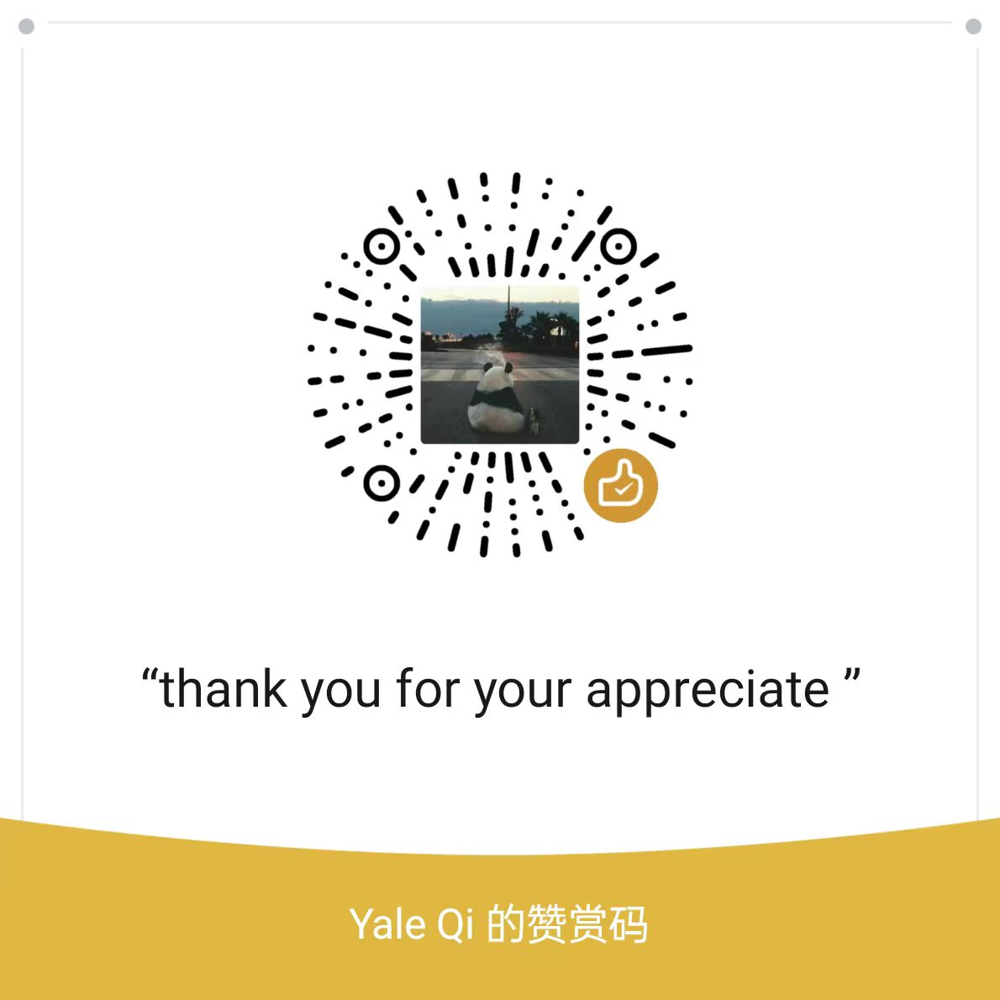

  

<!-- You can create your own header images using Canva, it has a lot of templates. If you do, use the following link https://www.canva.com/join/sgk-ckj-wcq -->

##

I'm a tech enthusiast who loves to learn about new things,I likes VR/AR/MR development. Connect with me on Gmail or come to Discode for communication.

### Projects

Apart from the pinned repositories, I have built:
- 🛡️ [VRstorm](https://github.com/gqiye/VRstorm) I am trying to put [this page](https://codesandbox.io/p/devbox/r3f-ts-playground-7ffjx5?file=%2FREADME.md) into VR mode

## Tech Stack

I mostly work with **JavaScript**, specifically **Node.js** in the backend. Recently, I have been tinkering with **Three**.

## support

I sincerely thank the wonderful people who support my open source work.

